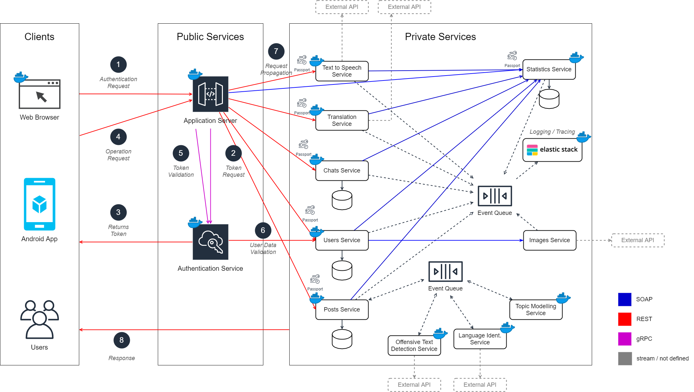

# Bienvenido a easidiomas
Easidiomas es una ecosistema para aprender idiomas de forma social. Esto significa que aprendes idiomas al mismo tiempo que conoces gente. El ecosistema está compuesto por una aplicación móvil para los usuarios y dos aplicaciones de administración, una web y otra CLI.

## ¿Qué puedo hacer en easidiomas?
Actualmente estamos trabajando en conseguir que easidiomas ofrezca las siguientes funcionalidades:

### Como usuario, dentro de easidiomas, podrás:
- Registrarte.
- Autenticarte.
- Buscar a otras personas que estén registradas, filtrando por:
  * Nombre de usuario.
  * Nombre real.
  * Edad.
  * Idioma/s hablado.
  * Idioma/s que quieren aprender.
- Seguir a otras personas que estén registradas.
- Ver los posts públicos de las personas a las que sigues.
- Publicar posts que las personas que te siguen verán en su feed.
- Establecer conversaciones privadas con otros usuarios.

### Como administrador, dentro de easidiomas, podras:
- Ver las estadísticas del ecosistema:
  * Número de usuarios registrados en las últimas 24h.
  * Número de posts realizados en las últimas 24h.
  * Número de conversaciones nuevas en las últimas 24h.
  * Número de mensajes personales enviados en las últimas 24h.
- Ver los usuarios registrados y sus datos.

### Además de todo esto, el sistema, automaticamente, realiza las siguientes acciones:
- Identifica el idioma de los posts.
- Traduce los mensajes de las conversaciones a demanda del usuario.
- Identifica y alerta de los posts que puedan contener texto ofensivo.
- Identifica los tópicos de los posts.

## ¿Cómo está contruido easidiomas?
Este ecosistema nace de una asignatura del Máster en Ingeniería Web de la Universidad de Oviedo. El objetivo es crear un sistema distribuido basado en servicios SOA/MSA donde se exploren los distintos tipos de comunicación entre servicios. Es por ello que se emplean comunicaciones SOAP, REST y gRPC.

En el diagrama anterior se puede ver que el sistema consta de 3 grandes segmentos. Uno donde se ubican los distintos clientes. Otro público que expone servicios y enruta peticiones. Y, un bloque privado que no está expuesto a internet donde residen los servicios que dan respuesta a las peticiones de los clientes. Los sevicios de los que se compone easidiomas son los siguientes:

| Servicio                                              | Lenguaje      | Descripción                                                                                                                       |
| ---------------------------------------------------- | ------------- | --------------------------------------------------------------------------------------------------------------------------------- |
| [webclient](./src/webclient)                           | React            | Expone por HTTP el sitio web que pueden usar los administradores del sistema. |
| [androidclient](./src/androidclient)                     | Native React            | Cliente android que expone la funcionalidad del sistema a los usuarios.                                                           |
| [authenticationservice](./src/authenticationservice) | .Net            | Provee un mecanismo de autenticación para los usuarios registrados y de verificación de identidad en las peticiones a los servicios.                        |
| [userservice](./src/userservice)             | Java       | Permite crear, actualizar, borrar y buscar usuarios. |
| [postsservice](./src/postsservice)               | Java       | Permite crear, actualizar, borrar y buscar posts.                                     |
| [chatsservice](./src/messagesservice)             | .Net            | Permite crear, actualizar, borrar y buscar conversaciones individuales.                                 |
| [translationservice](./src/translationservice)                   | .Net        |A demanda de otros servicios traduce el texto que sea necesario al idioma seleccionado.                                                                                   |
| [texttospeechservice](./src/texttospeechservice)             | Python            | Para una entrada de texto genera un audio que representa la entrada convertida a habla humana en el mismo idioma.                            |
| [statisticsservice](./src/statisticsservice) | Java        | Permite centralizar todas las estadísticas relativas a las entidades del sistema en un mismo sitio. No es un sistema de monitorización del sistema si no más bien una caché de estadística. En este sistema se pueden encontrar datos como el número de mensajes por usuario, el número de usuarios registrados en las últimas 24h, etc.                                                                      |
| [offensivetextdetectionservice](./src/offensivetextdetectionservice)                         | Python          | Continuamente busca texto que puea ser ofensivo dentro de los posts nuevos.                                                                                   |
| [languageidentservice](./src/languageidentservice)                 | Java | Para los posts nuevos identifica el lenguaje en el que están escritos y etiqueta dichos posts.                                              |
| [topicmodelingservice](./src/topicmodelingservice)                 | Python | Para los posts nuevos se identifican los posibles tópicos que contenga el post.                                              |

Una vez vistos los servicios que componen el ecosistema para acceder a ellos se emplea un servicio oculto, una API Gateway que expone los siguientes endpoints:

| Endpoint | Método | Cabeceras | Cuerpo | Resultado|Descripción|
|----------|--------|-----------|--------|----------|-----------|
|`/api/v1/auth/token`|GET|Username, Password||200 + Token, 401|Valida las credenciales y genera un token de acceso.|
|`/api/v1/auth/passport`|GET|Token||200 + Passport, 401|Verifica el token de acceso y genera un pasaporte para la petición.|
|||||||
|`/api/v1/users?filters`|GET|Token||200 Users|Busca entre los usuarios aplicando los filtros.|
|`/api/v1/users`|POST|Token|User|201 + User, 409|Crea un nuevo usuario.|
|`/api/v1/users/{id}`|GET|Token||200 + User, 404|Devuelve un usuario concreto.|
|`/api/v1/users/{id}`|PATCH|Token|User|200 + User, 404-409|Modifica un usuario.|
|`/api/v1/users/{id}`|DELETE|Token||200, 404|Elimina un usuario.|
|||||||
|`/api/v1/users/{id}/chats`|GET|Token||200 Chats, 404|Devuelve todos los chats de un usuario.|
|`/api/v1/users/{id}/chats/{id}`|GET|Token||201 Chat, 404-409|Devuelve el chat entre dos usuarios|
|`/api/v1/users/{id}/chats/{id}`|PUT|Token|Message|200, 404|Añade un mensaje al chat entre dos usuarios. Si el chat no existe lo crea.|
|`/api/v1/users/{id}/chats/{id}`|DELETE|Token||200, 404|Elimina un chat entre dos usuarios.|
|||||||
|`/api/v1/statistics`|GET|Token||200 Statistics, 404|Devuelve todas las estadísticas del ecosistema.|
|`/api/v1/users/{id}/statistics`|GET|Token||200 Statistics, 404|Devuelve las estadísticas de un usuario.|
|||||||
|`/api/v1/translations`|POST|Token|`{text:text,from-lang:lang,to-lang:lang}`|201 Translation, 404|Devuelve la traduciión para un texto dado.|
