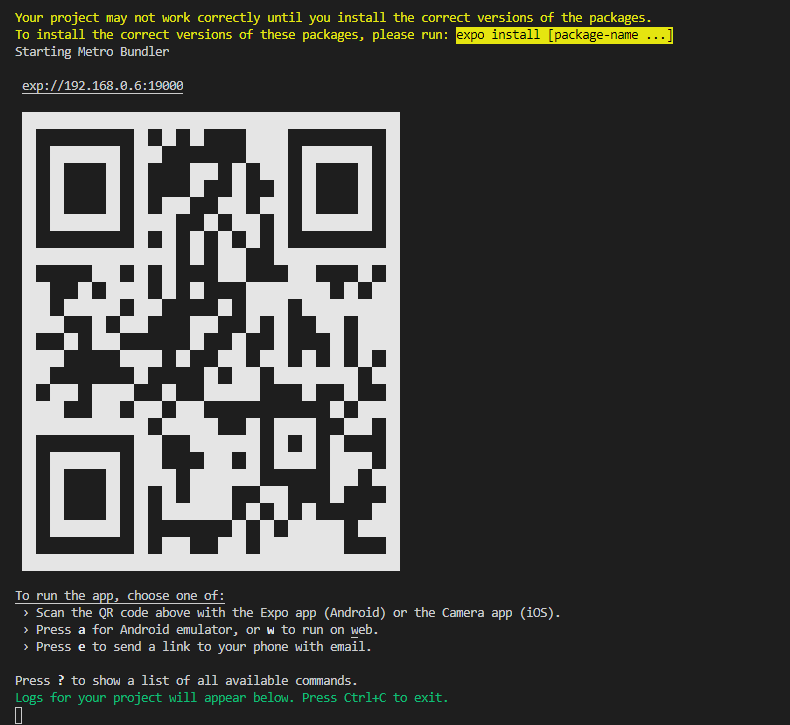
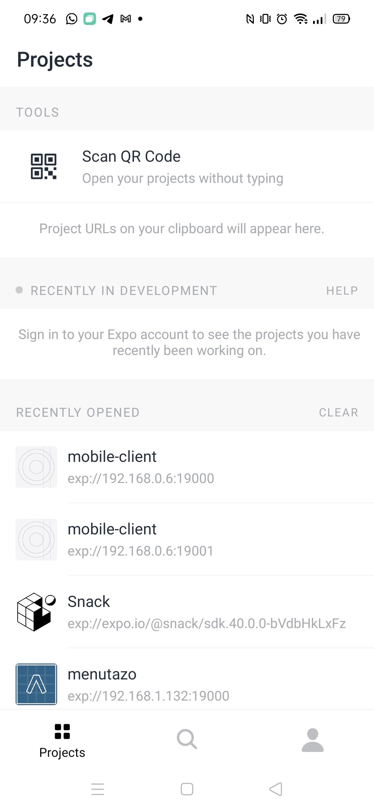

# Cliente Móvil

|||
|-|-|
|**Nombre del Servicio:**|Cliente Móvil|
|**Responsabilidad:**|Cliente móvil que expone la funcionaldiad a los usuarios de la aplicación.|
|**Lenguaje de Programación**|JavaScript (React-Native)|
|**Servicios que Consume:**|Servicio de Usuarios (REST), Servicio de Posts (REST) y Servicio de Chats (REST), Servicio de Texto a Voz (REST) y el Servicio de Traducción (REST).|
|**Servicios que Ofrece:**|-|
|**Bases de datos:**|-|

## Funcionalidades

|||
|-|-|
|**Categoría:**|**Funcionalidad**|
|Login|Los usuarios no administradores se pueden loguear en la aplicación|
|SignUp|Los usuarios no identificados se pueden registrar en la aplicación|
|Post|Visualización de posts en todos los idiomas|
||Visualización de posts en los idiomas que está aprendiendo el usuario|
||Publicar un post|
||Dar like a un post|
|Discover|Visualización de usuarios de la aplicación|
|Chats|Visualización de los chats del usuario|
||Crear un nuevo chat|
||Visualizar mensajes de un chat|
||Crear un nuevo mensaje en un chat|
|Perfil|Consultar perfil del usuario logueado|
||Consultar perfil del usuario logueado|
||Consultar el perfil de un usuario|

## Funcionamiento
Para poder acceder al cliente movil en primer lugar es necesario tener instalada la aplicación ["Expo Go"](https://play.google.com/store/apps/details?id=host.exp.exponent&hl=es&gl=US) en nuestro dispositivo movil (en Iphone debería poderse tamibén aunque no se ha probado). A continuación, realizar un "npm install" sobre la raiz del directorio [mobileclient](../src/mobileclient). Una vez se hayan instalado todas las dependencias, ejecutar el comando "npm start".

Cuando se encuentre deplegado podremos observar un código QR en nuestra consola como se muestra abajo.

Este código  QR deberá ser escaneado desde nuestra aplicación Expo Go. IMPORTANTE! Es necesario que el dispositivo movil y el ordenador se encuentren dentro de la misma red.
Para escanear el código ejecutamos la aplicación Expor go y vamos a la pestaña inferior de proyectos. En la parte superior hay una opción que nos permite escanear nuestro código QR.

