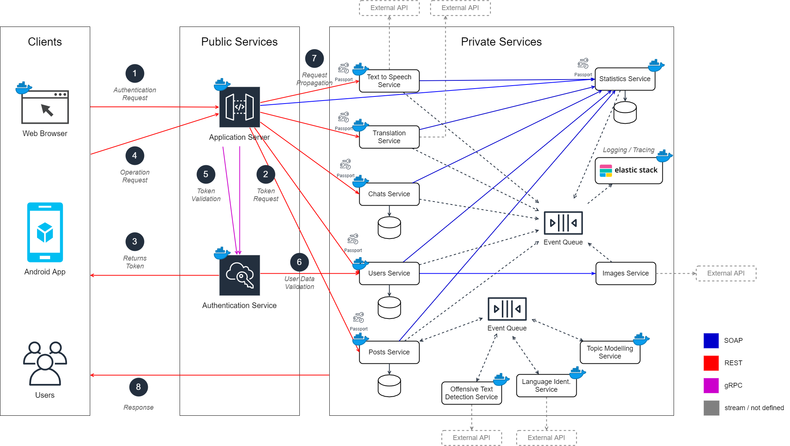

# Arquitectura de la Solución

Este ecosistema nace de una asignatura del Máster en Ingeniería Web de la Universidad de Oviedo. El objetivo es crear un sistema distribuido basado en servicios SOA/MSA donde se exploren los distintos tipos de comunicación entre servicios. Es por ello que se emplean comunicaciones SOAP, REST y gRPC.

En el diagrama anterior se puede ver que el sistema consta de 3 grandes segmentos. Uno donde se ubican los distintos clientes. Otro público que expone servicios y enruta peticiones. Y, un bloque privado que no está expuesto a internet donde residen los servicios que dan respuesta a las peticiones de los clientes. Los sevicios de los que se compone easidiomas son los siguientes:

| Servicio                                              | Lenguaje      | Descripción                                                                                                                       |
| ---------------------------------------------------- | ------------- | --------------------------------------------------------------------------------------------------------------------------------- |
| [webclient](../src/webclient)                           | React            | Expone por HTTP el sitio web que pueden usar los administradores del sistema. |
| [androidclient](../src/androidclient)                     | Native React            | Cliente android que expone la funcionalidad del sistema a los usuarios.                                                           |
| [authenticationservice](../src/authenticationservice) | .Net            | Provee un mecanismo de autenticación para los usuarios registrados y de verificación de identidad en las peticiones a los servicios.                        |
| [userservice](../src/userservice)             | Java       | Permite crear, actualizar, borrar y buscar usuarios. |
| [postsservice](../src/postsservice)               | Java       | Permite crear, actualizar, borrar y buscar posts.                                     |
| [chatsservice](../src/messagesservice)             | .Net            | Permite crear, actualizar, borrar y buscar conversaciones individuales.                                 |
| [translationservice](../src/translationservice)                   | .Net        |A demanda de otros servicios traduce el texto que sea necesario al idioma seleccionado.                                                                                   |
| [texttospeechservice](../src/texttospeechservice)             | Python            | Para una entrada de texto genera un audio que representa la entrada convertida a habla humana en el mismo idioma.                            |
| [statisticsservice](../src/statisticsservice) | Java        | Permite centralizar todas las estadísticas relativas a las entidades del sistema en un mismo sitio. No es un sistema de monitorización del sistema si no más bien una caché de estadística. En este sistema se pueden encontrar datos como el número de mensajes por usuario, el número de usuarios registrados en las últimas 24h, etc.                                                                      |
| [offensivetextdetectionservice](../src/offensivetextdetectionservice)                         | Python          | Continuamente busca texto que puea ser ofensivo dentro de los posts nuevos.                                                                                   |
| [languageidentservice](../src/languageidentservice)                 | Java | Para los posts nuevos identifica el lenguaje en el que están escritos y etiqueta dichos posts.                                              |
| [topicmodelingservice](../src/topicmodelingservice)                 | Python | Para los posts nuevos se identifican los posibles tópicos que contenga el post.                                              |